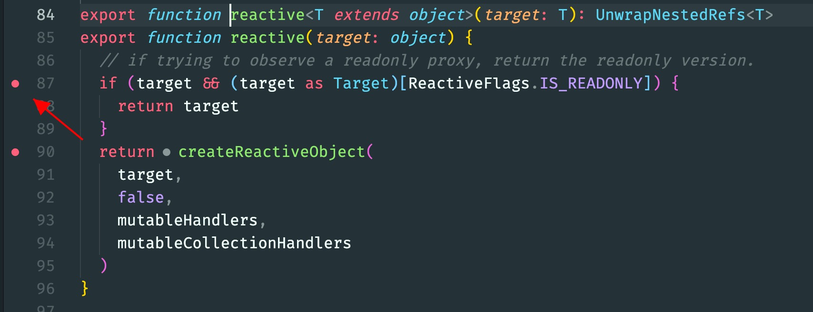
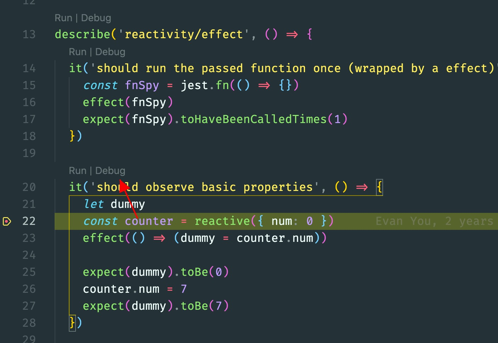

在前端页面开发中我们通常使用`debugger`进行调试，node 开发中使用 vscode 断点调试，熟练的使用调试功能能够明显提升我们排查错误的效率。同样在阅读源码、编写插件等都需要调试功能，本文将介绍几种常用的调试技巧帮助你顺利阅读开源项目，轻松开发插件。

### Jest Runner
  下面将以vue-next源码为例，介绍如何通过测试用例阅读调试程序。
- 在vscode插件市场中下载Jest Runner插件
- 找到需要阅读的源码模块，对源码不太明白的地方打上断点

- 找到对应模块的测试用例，点击下图中的Debug就可以愉快的进行阅读了

### Node Inspect
