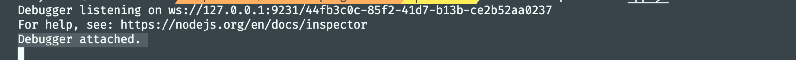
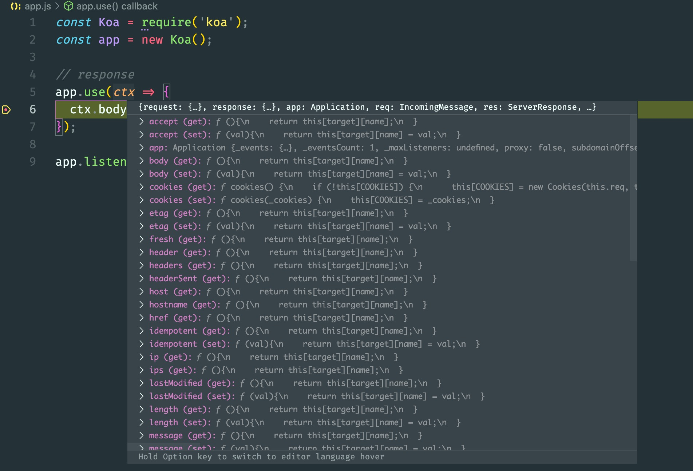
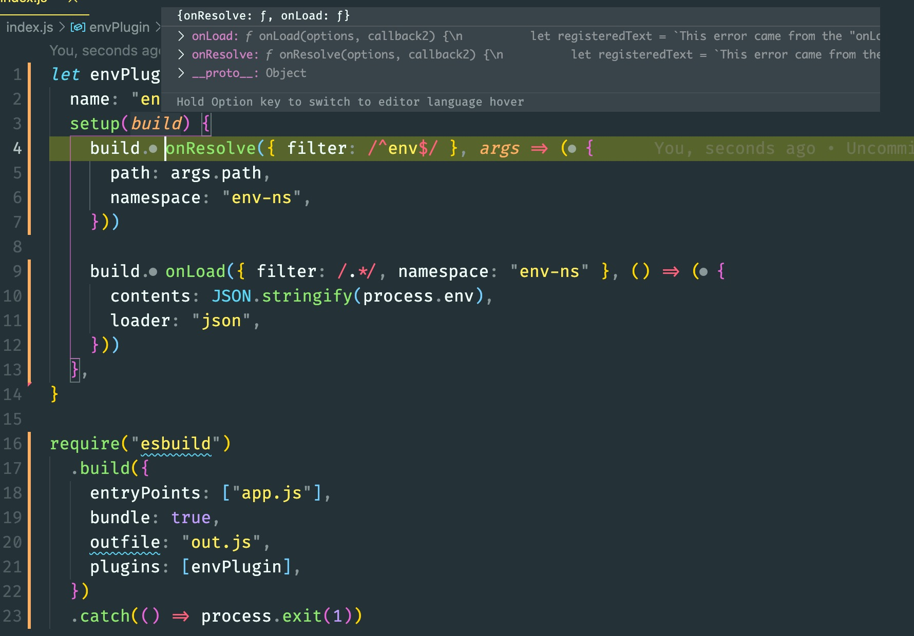

### 前言

在前端页面开发中我们通常使用`debugger`进行调试，node 开发中使用 vscode 断点调试，熟练的使用调试功能能够明显提升我们排查错误的效率。同样在阅读源码、编写插件等都需要调试功能，本文将介绍几种常用的调试技巧帮助你顺利阅读开源项目，轻松开发插件。

### Jest Runner

下面将以 vue-next 源码为例，介绍如何通过测试用例阅读调试程序。

- 在 vscode 插件市场中下载 Jest Runner 插件
- 找到需要阅读的源码模块，对源码不太明白的地方打上断点
  
- 找到对应模块的测试用例，点击下图中的 Debug 就可以愉快的进行阅读了
  

### Node Inspect

使用`node --inspect`和`node --inspect-brk`调试 node 程序和脚本，默认情况下侦听 127.0.0.1:9229 的域名和端口号。

#### --inspect 和--inspect-brk 两者区别

`node --inspect`执行时，程序会直接执行完成不会中断。`--inspect-brk`通常用来调试一些脚本，会在程序运行的第一行开始断点。

#### 服务调试

对于`--inspect`这种调试模式我们可以用在我们的 node 服务开发中，基于请求去做断点调试。以 koa 服务为例，新建`app.js`并写入以下内容。

```javascript
const Koa = require("koa")
const app = new Koa()

// response
app.use(ctx => {
  ctx.body = "Hello Koa"
})

app.listen(3000)
```

命令行中输入`node --inspect index.js`启动服务。打开命令面板，根据不同平台按下以下快捷键：Ctrl + Shift + P（Windows），Cmd + Shift + P（Mac），选择`Debug: Attach To Node Process`，然后找到对应的程序。此时命令行中输出一行`Debugger attached.`代码程序已经处于调试模式。

在相对位置打上断点，访问`http://localhost:3000/`就能看到请求被断住了。


#### 脚本调试

我们以 esbuild 官方插件教程为例，讲解如何调试一个 cli 插件，新建一个文件`app.js`，并写入以下内容。

```javascript
import { PATH } from "env"
console.log(`PATH is ${PATH}`)
```

然后新建一个`index.js`文件，写入官方[示例代码](https://esbuild.github.io/plugins/#using-plugins)。

```javascript
let envPlugin = {
  name: "env",
  setup(build) {
    build.onResolve({ filter: /^env$/ }, args => ({
      path: args.path,
      namespace: "env-ns",
    }))

    build.onLoad({ filter: /.*/, namespace: "env-ns" }, () => ({
      contents: JSON.stringify(process.env),
      loader: "json",
    }))
  },
}

require("esbuild")
  .build({
    entryPoints: ["app.js"],
    bundle: true,
    outfile: "out.js",
    plugins: [envPlugin],
  })
  .catch(() => process.exit(1))
```

命令行中输入`node --inspect-brk index.js`启动脚本，打开命令面板找到对应的脚本程序，我们就可以在脚本中去断点了。


### 总结

熟练的使用调试技巧不仅能让我们开发提效，通过可视化的上下文变量面板摆脱`console.log`和记忆上下文，在学习开源项目的事半功倍。
